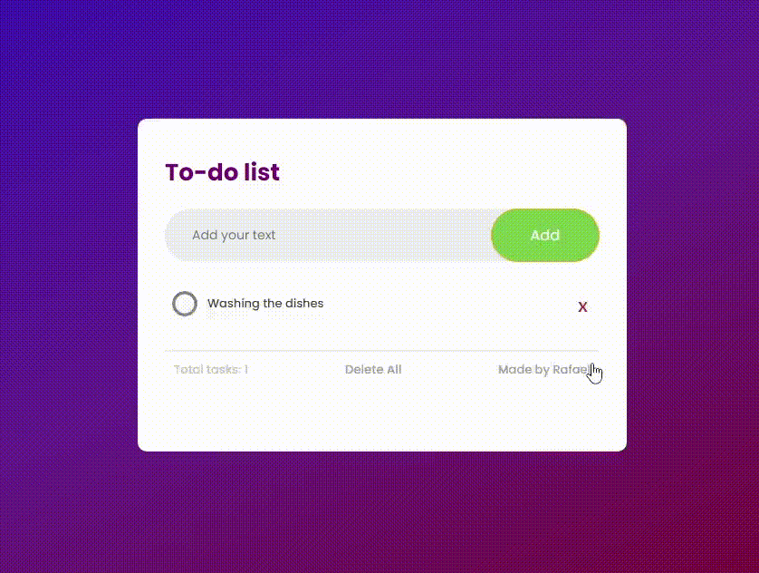

# ToDoList <h6>ENGLISH</h6>

<h2>A aesthetic design and dynamic Flask To-Do-List Website built with HTML, CSS and Python.</h2>
 

<h1 align="center">
</img>
</h1>

<h1 align="center"> About To-Do-List </h1>
<h4>Our mission is to give everyone a website where you won't have to remember things once they are written down like a checklist.
We believe that everyone deserves to have a chance to organize yourself, and with that the day-to-day would be way better and easier.
So you won't need to keep remembering the things you have to do, and you won't have to face the consequences of forgetting these things.</h4>
 

Database included.

  <footer>
     
    <a href="https://www.instagram.com/vinyyboy_seewald/" target="_blank"></img></a>
    <h5>| Made with ❤️ by: Rafael Seewald👋|</h5>
  </footer>

